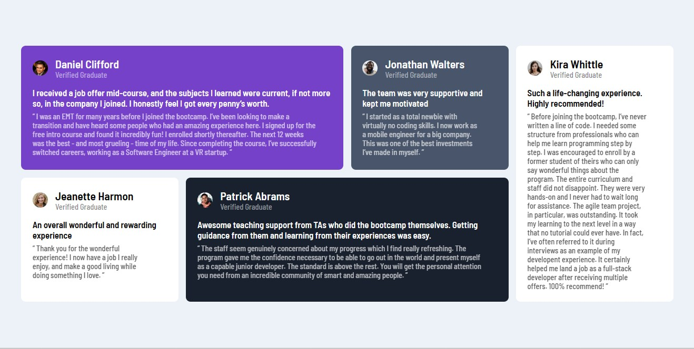

# Frontend Mentor - Testimonials grid section solution

This is a solution to the [Testimonials grid section challenge on Frontend Mentor](https://www.frontendmentor.io/challenges/testimonials-grid-section-Nnw6J7Un7). Frontend Mentor challenges help you improve your coding skills by building realistic projects.

## Table of contents

- [Overview](#overview)
  - [The challenge](#the-challenge)
  - [Screenshot](#screenshot)
- [My process](#my-process)
  - [Built with](#built-with)
  - [Useful resources](#useful-resources)
- [Author](#author)

## Overview

This is a perfect program to test your grid skills I learned alot while I am programming it and it is very good
the one thing I didn't like that there is a huge amount of words I took about one hour to put the words in tags.

### The challenge

Users should be able to:

- View the optimal layout for the site depending on their device's screen size

### Screenshot

Note: Different sizes of screens have different layoyts so if you want to see the website like in the picture you can minimize the screen enlargement rate or by clicking inspect and select the mobile icon above in the right and set the width to 1300px or above.

## My process

### Built with

- Semantic HTML5 markup
- CSS custom properties
- Flexbox
- CSS Grid
- Mobile-first workflow

### Useful resources

- [grid-template-areas W3 schools](https://www.w3schools.com/cssref/pr_grid-template-areas.php) This helped me to know about grid-template-areas.

## Author

- Frontend Mentor - [@MohamedAtTop](https://www.frontendmentor.io/profile/MohamedAtTop)
